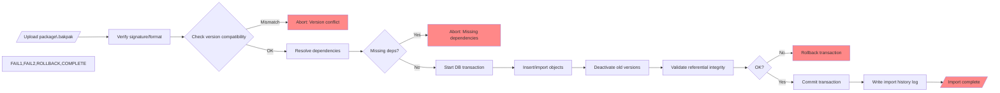

# Executive Summary  

We evaluated the proposed Forge import/deployment model against industry practices for configuration packaging and migration. Modern approaches range from simple ZIP bundles of JSON/YAML files to **OCI-style artifact registries** with signed images. Each format has trade‑offs in readability, versioning, and security. For updates, an **“insert + deactivate” (versioned insert)** strategy preserves history and enables safe rollback, whereas in-place updates or merges (upserts) each have strengths/weaknesses. Dependency resolution typically requires ordering imports by schema relationships (graph ordering) within transactions or controlled phases. To ensure idempotency, the system should track each import in a history log (with status and object changes). For runtime business data, added fields should be nullable/optional or require explicit migration/backfill to avoid breaking existing records. Name and UID conflicts (including the MasterPrefix) must be detected, with rules to skip or merge duplicates. We recommend a **package-based deployment workflow** (e.g. a non‑readable “.bakpak”) that Forge imports via a transactionally safe process, logs all changes, enforces validation (schema/version checks), and can roll back by reactivating prior versions. Security measures (signing, access controls, encryption) are essential.  

The detailed analysis below compares packaging formats, evaluates update strategies (insert+deactivate vs update vs merge), outlines dependency and idempotency handling, and concludes with recommended workflows, tables of options, a suggested database schema for import tracking, and illustrative diagrams.

---

## 1. Packaging Formats and Tools  

**Common formats:** Enterprises typically package config/metadata as:  

- **ZIP archives** (often with an XML/JSON/YAML manifest). *Examples:* Microsoft’s Dynamics 365 Config Migration tool exports a ZIP that encapsulates schema and data. Adobe AEM and Salesforce use ZIP (with XML) for deployments. ZIP is simple and widely supported (readable by standard tools).  

- **JSON/YAML bundles** (directory of text files). *Examples:* Many DevOps and GitOps tools (Kubernetes manifests, Keycloak config CLI, Terraform) use YAML/JSON files in a repo. This is human-readable and diff-friendly, but requires careful tooling to combine or compress for deployment (many individual files).  

- **Binary or proprietary packages** (custom format). A “.bakpak” or similar could be an encrypted/compressed binary blob. This is opaque to users (security by obscurity) but must be handled by tooling. It can include complex structures but is harder to review manually.  

- **OCI/Registry artifacts:** Storing config bundles in a container registry (OCI image or artifact) is an emerging pattern (GitOps). For example, Flux CD supports an `OCIRepository` that pulls a tarball from an OCI registry. Azure’s ACR can store signed artifacts (images, Helm charts, config bundles). OCI artifacts allow pushing/pulling via standard Docker tools, enable versioning, and support signing. The content itself can be a tarball of YAML/JSON.  

- **Signed packages:** Regardless of format, strong solutions support signing (e.g. GPG or Notary). The Azure guidance emphasizes signing OCI artifacts to ensure *integrity and authenticity*. Similarly, key management (e.g. using Notation/Key Vault) can automate signing of packages.  

**Tooling:** Platforms often provide CLI or UI to create/export packages (e.g. D365 Migration Tool, Oracle Enterprise Manager, custom scripts) and to import/apply them. Many enterprise tools (Salesforce DX, AEM, ServiceNow, Dynamics) allow packaging as ZIP. Using standard formats (ZIP, YAML/JSON) increases interoperability. OCI-based packaging requires a registry but offers version tracking and reuse.  

**Comparison:** 

| Format           | Pros                                         | Cons                                          | Use Cases                                 |
|------------------|----------------------------------------------|-----------------------------------------------|-------------------------------------------|
| **ZIP (folder)** | Easy to generate/read with existing tools. Can contain mixed XML/JSON/SQL. Supports compression. | Opaque diff (must unzip to inspect).  No built-in signature (needs separate signing). Requires manifest to map contents. | Traditional enterprise deploy (e.g. CRM, ERP migrations). |
| **JSON/YAML dir**| Human-readable, diff/merge friendly. Easy to source-control. Explicit structure. | Many files to manage (upload one-by-one or ZIP for transport). Merging changes from multiple apps more complex. | Cloud-native (Kubernetes, Terraform). Good if teams edit text config directly. |
| **Proprietary bin** | Opaque, potentially compact/encrypted. Can embed complex logic. | Hard to audit. Tools must fully own serialization. Limited diffability. | When IP needs protection, or to simplify UX (one file). Custom in-house platforms. |
| **OCI artifact** | Leverages container registry (versioned, signed). Familiar workflows (push/pull). Can sign. Allows layering. | Requires registry infrastructure. More complex initial setup. | GitOps workflows; distributing config between clusters. Useful when sharing via CI/CD pipelines. |
| **Signed package**| *(Overlay on above)*: Ensures integrity/authenticity. Can use PKI/Notary. | Needs key management. Adds overhead to build/release. | Any of above where security is critical (finance, healthcare, etc.). |

*Industry sources:* The Azure registry guidance notes that config bundles can be treated as OCI artifacts with signatures. The Dynamics 365 Migration example uses a ZIP bundle, requiring matching schemas and no duplicate imports (existing records become draft, not duplicated). GitOps tools like Flux support OCI-based configs.

---

## 2. Update Strategy: Insert+Deactivate vs Update vs Merge  

When importing new definitions, three broad strategies arise:

- **Versioned insert + deactivate old (our proposal):** On import, existing objects are *retired/inactivated* and new versions are inserted. This retains the old version in the database (for history/rollback) and makes the imported version active. *Pros:* Clear audit trail and version history; easy rollback (reactivate old); avoids accidental in-place data loss. *Cons:* Data relationships may point to old vs new version; increased storage; referential integrity must be managed (updates to pointers if needed). This pattern resembles a Slowly Changing Dimension (type 2) or using UUID versioning.

- **In-place update (overwrite existing):** Import data for an existing object replaces its definition directly. *Pros:* Simpler (no duplicate records). *Cons:* Destroys old version (no built-in history); requires careful data migration (e.g. adjusting business records to new schema); harder to rollback without external backup. If fields are added, existing data must be migrated (e.g. defaulted or backfilled). This can break live systems if not atomic.

- **Merge/Upsert:** Perform a SQL MERGE-like operation: update matching records and insert non-matching ones, usually based on an identifier. *Pros:* Single atomic operation that avoids duplicates (e.g. DynamoDB `putItem` with conditional), often idempotent. Maintains continuity (no duplicate object). *Cons:* Harder to preserve history (typically overrides old version); complex if schema changes drastically. It blends properties of update and insert. 

**Industry practice:** Data platforms often prefer upserts (merge) for efficiency. For example, Delta Lake’s `MERGE` can update and insert in one atomic query, allowing huge datasets to be incrementally updated without full rewrites. This maintains a *single source of truth* via transaction logging. However, configuration metadata often needs explicit versioning and audit; many systems (including Data APIs) export new version records rather than patching existing ones. 

In the Dynamics config example, “matching records aren’t duplicated” and existing records become drafts on import. In practice that is a form of upsert that preserves the identity but changes state. If Forge uses *versioned insert+deactivate*, it can emulate a protected “draft/version” model. 

We suggest the **versioned insert model**, because it best supports: *strict auditing and rollback*, enforcing that only one active version exists at runtime. Older versions remain in DB for reference. The main drawback (referential cleanup) can be managed via transactional import.

**Recommendation:** On import, perform an “upsert” at the object-definition level by inserting the incoming object version and marking any pre-existing active version as inactive. Do not update in place. If a fully in-place update is needed (e.g. minor edit), handle it as deactivate/insert under the covers. Use database transactions so that related metadata (views, relationships) are updated together. This preserves history.  

*Supporting detail:* Upsert patterns (e.g. Delta Lake MERGE) are efficient for large data, but in a config setting the history requirement often outweighs efficiency. The Delta Lake example shows how a MERGE avoids rewriting 53M rows and keeps versions. We would incorporate similar techniques (MERGE for efficiency) but then record a new version entry in Forge’s metadata tables.

---

## 3. Dependency Resolution and Transaction Management  

Imported objects often reference each other (interfaces, classes, relationships). Forge must handle **referential integrity** carefully. Best practice is to: 

- **Compute import order:** Build a dependency graph of objects/interfaces so that parent schema elements are imported before children. For example, if `B` depends on interface `A`, import `A` first. Topological sort (as in deployment pipelines) ensures dependencies exist when needed.  
- **Single transaction or controlled phases:** Within Forge, import steps (insert/deactivate) for a package should be wrapped in a database transaction, so all changes either commit or rollback together. This enforces consistency. If DB systems lack multi-statement transactional DDL/DDL, then use a phased approach: insert everything as *pending*, then activate if no errors.  
- **Validation:** Before applying, validate that referenced objects/interfaces exist (or are included in the package). For example, if a class in the package requires an interface not yet in the target, the import should fail or prompt for the interface to be included first.

*Industry note:* Migration tools like Dynamics Configuration Migration require generating an identical schema beforehand. They even validate relationships “to keep you from leaving out dependencies”. Similarly, Forge should validate that all relationships and graph definitions in a package refer to existing (or being imported) schema.

- **Transactional vs Eventual:** Ideally, use a single transaction for the import batch so that partial failures leave the system in a consistent state (all or nothing). If that’s not possible, carefully handle partial failures: e.g. if inserting one object fails, rollback prior inserts and abort the import.

**Recommendation:** Forge should resolve dependencies by doing a topological sort of the import manifests and then apply inserts/deactivations in sorted order within a transaction. Use DB constraints or application logic to verify referential integrity. If any part fails, roll back the whole import (or abort and mark import as failed).

---

## 4. Idempotency and Import History  

Forge needs to handle repeated imports and maintain a history of changes. To achieve idempotency and audit trails:

- **Unique Package ID / Manifest:** Each import package should have a unique identifier (e.g. a package name + version). Within the package, objects have stable IDs (GUIDs) so Forge can match them across imports.  

- **Import Log Table:** Maintain tables such as `Imports` and `ImportRecords`. For example:

  - **Imports**(`ImportID`, `PackageName`, `PackageVersion`, `UploadedBy`, `UploadedAt`, `Status`, `Notes`) – tracks each uploaded package.  
  - **ImportRecords**(`RecordID`, `ImportID`, `ObjectID`, `OldObjectID`, `Action` {Insert, Update, Skip, Conflict}, `Timestamp`, `User`) – details what happened to each object/interface during that import (new version created, old deactivated, etc.).  

  This log ensures a full audit trail (who imported what and when) and aids rollback (e.g. flagging which `ObjectID` was superseded).  

- **Idempotency checks:** When an import is retried (or the same package re-uploaded), Forge should recognize if an identical version was already applied. For example, by checking `Imports` for the same package hash or ID. It could then skip or error out to prevent duplicate versions.  

- **Deduplication:** If two packages define the same object ID (and same MasterPrefix), Forge must detect it. Either treat it as an update to the existing object or require the object ID to be unique per tenant.  

*Example (Dynamics):* “If you import a record that already exists, it ends up as draft…matching records aren’t duplicated”. Forge’s log can do similar: if an object ID matches an existing one, do an “Update” action rather than Insert (but based on version strategy, that means deactivate+insert).

**Recommendation:** On each import, record all actions. Use a **SQL MERGE or SELECT/INSERT** pattern keyed by stable object IDs to decide insert vs update. After import, ensure each object has a current version (e.g. a boolean flag) set. The history tables (Imports/ImportRecords) provide accountability and support rollbacks.

---

## 5. Runtime BusinessData Compatibility  

A key risk: existing runtime BusinessData (actual records) referring to old schema. When schema changes (new properties/interfaces), how to keep BusinessData valid?

- **Additive changes (safe):** If the package adds new fields (properties) or relationships, existing data can simply treat those as NULL/undefined. For example, if a Class gains a new optional field, existing records have a blank value. This is like a backward-compatible schema change.  

- **Mandatory new fields (migration needed):** If a new property is mandatory (no defaults), existing records violate this constraint. Forge should forbid such an import unless a migration strategy is provided. Options: require a default value for existing rows, or enforce a data backfill phase.  

- **Removed/renamed fields:** Deleting or renaming properties/interfaces is backward-incompatible (existing data has “orphan” columns). Forge should treat removals as version-breaking (perhaps automatically move those fields to an “Extension” object to preserve data, or reject the change).  

- **Data mapping:** For cases like splitting an object into two, Forge would need explicit mapping rules (out of scope for v1 unless planned).  

*Recommendation:* By default, treat new fields as nullable and do not force-backfill. Record on the import that existing rows have nulls for new properties. If admins mark a new field as mandatory, require they supply a default or migration. Align with schema compatibility best practices: e.g. JSON Schema allows adding optional fields without breaking backward compatibility. Document that BusinessData may be incomplete until manually updated or migrated. 

---

## 6. Conflict Resolution (Name/UID and MasterPrefix)  

Collisions can occur when imported objects share names or IDs with existing ones:

- **Object identity:** Forge should use globally unique IDs (GUIDs). If an import contains an object with an ID already present: it’s likely the same conceptual object (especially if MasterPrefix matches), so treat as update (deactivate old and insert new). If MasterPrefix differs, decide policy: perhaps **namespace** them or reject import until clarified.  

- **MasterPrefix:** Per earlier discussion, a MasterPrefix tags objects to distinguish tenants/projects. On import, if the prefix in the package doesn’t match the target tenant’s, Forge could automatically substitute it or enforce that prefix at creation time.  
  - *Strategy:* If an object from one MasterPrefix collides with another, Forge could either skip the import of that object or require the admin to remap via configuration. Best to enforce unique MasterPrefix per package.  

- **Name collisions:** If two objects share the same logical name (e.g. “Employee”) but are different definitions, Forge should compare their schema. If identical, it can reuse; if different, namespace or error. Using IDs rather than names is more robust.  

*Example:* If “Employee” from HR app and “Employee” from Leave app are same global object (shared), import should detect this (same MasterPrefix or manifest dependency) and not create duplicates. If accidentally same name but different content, Forge should treat as conflict.  

**Recommendation:** Use Object IDs (with MasterPrefix) as primary keys. On import, check for existing ID conflicts; if found and content differs, log a conflict and abort (or prompt for merge strategy). Handle MasterPrefix by rejecting or renaming conflicts. Maintain a mapping table if needed (import ID → target ID) to support incremental imports.

---

## 7. Rollback, Auditing, and Deployment Safety  

A robust system must allow reverting a bad import. With versioned insert:

- **Rollback:** If an import fails mid-way, the transaction should roll back entirely. If it succeeds but is later deemed bad, the admin could perform a “rollback import” by reactivating the previous version (set the old version’s `Active=true` and new version’s `Active=false`). The history tables make this feasible. Recommend providing a UI/API to select a prior import and revert it. 

- **Audit trail:** The `Imports` and `ImportRecords` tables provide full history. Each object table could also carry version comments (e.g. “Imported from package XYZ”). Combine this with user logs. Ensure Forge disables auto-rollbacks without human control (best practice: “Never trust auto-rollbacks with production data”).  

- **Safe deployment patterns:** Use **blue-green or two-phase deployments** for the highest safety. For example, import into a staging schema, run validation or dry-run, then switch labels. At minimum, apply configs in maintenance windows or under feature flags. Ensure migrations are backward-compatible to allow the previous version of the application to work briefly with new schema (database first migration).  

*Recommendation:* Emphasize auditing: always log the before/after. For rollback, provide a mechanism to “undo” imports by toggling active flags. Advise admins to test imports on a non-production environment first. Follow schema migration best practices (run migrations before new code). Write down-migration scripts if possible.  

---

## 8. Security Considerations  

Key concerns are package integrity, authentication, and confidentiality:

- **Signing & verification:** Require packages to be signed (e.g. use public/private key or Notation for OCI). As the Azure guidance states, signing provides *integrity and authenticity*: “the artifact is exactly the one published”. Forge should verify the signature before importing. If an OCI registry is used, leverage Notary/Notation or AWS Signer. Reject any unsigned or tampered package. 

- **Access control:** Ensure only authorized users (admins) can upload/import packages. The package and its objects should be confined to the tenant/project scope as intended.  

- **Encryption:** If the package contains sensitive info (e.g. API keys), use encryption. Do **not** store plaintext secrets in the package. The Google SRE book emphasizes *treating config as code* with peer review and says “Never trust unreviewed config”. Use secret-management (HashiCorp Vault, KMS) for credentials.  

- **Isolating environments:** Use separate deployment pipeline or container for staging vs prod. Signed packages can be tested on dev before import to prod.  

*Recommendation:* Adopt “verify artifacts not just people” principles. Automate signing as part of build (CI/CD) and enforce signature checks at import time. Keep the import system’s keys secure. Log all import actions for audit. Encrypt any sensitive fields inside the package. Educate admins to review diffs before import, as recommended for config-as-code.  

---

## 9. Alternative Strategies & Trade-offs  

Beyond a single package/unit approach, Forge could consider:

- **Package-per-app:** Each application’s config is bundled and imported separately (as originally suggested). *Pros:* Scoped changes, easier testing per app. *Cons:* Hard to share objects; may duplicate effort if apps share schemas.  

- **Package-per-feature or module:** Divide by functionality (e.g. “Asset management config”, “HR config”). *Pros:* Smaller packages, more flexible scheduling. *Cons:* Could require careful ordering of feature imports if they share dependencies.  

- **Incremental diffs:** Instead of full export, generate a diff package (only changed objects). *Pros:* Smaller payloads, faster import. *Cons:* Complex to compute diffs reliably; risk of missing context if prior version not present.  

- **Artifact registry (OCI):** Store packages in a versioned registry. *Pros:* Easy distribution; integrates with CI/CD; can “pull” specific tags. *Cons:* Infrastructure needed; may be overkill for self-managed Forge.  

- **Live migrations:** Instead of offline packages, one might use migrations (scripts or procedures) that modify config in place. *Pros:* Real-time; can use familiar DB migrations tools. *Cons:* Harder to roll back; not suited for non-DB config.  

| Strategy             | Pros                                           | Cons                                         |
|----------------------|------------------------------------------------|----------------------------------------------|
| Per-App Package      | Clear app boundaries, simple for single-team.  | Hard to reuse shared objects; potential collisions if multiple apps import same object. |
| Per-Feature Package  | Fine-grained updates. Can match business deliverables. | Need coordination if features interdependent. |
| Full Suite (Project) | One bundle of everything; all-or-nothing consistency. | Large; difficult to version-partially; no modularity. |
| OCI Registry Artifact| Standard registry workflow; easy versioning; signing support. | Extra infrastructure; learning curve. |
| Incremental Diff     | Fast updates; minimal data transfer.           | Complex merge logic; risk of conflict if out of sync. |
| Live Migration Tool  | Scripted, potentially reversible steps.        | Tightly coupled to DB; not good for high-level metadata. |

*Recommendation:* For Forge v1, a **package-per-app** or **per-application** approach seems simplest. It aligns with the idea that each BusinessData object has one owning application. However, ensure the package can include all needed shared objects and dependencies. Using OCI or diffs can be future enhancements after basic import works. 

---

## 10. Recommended Import Workflow  

A recommended step-by-step process, also illustrated in the flowchart below:



1. **Upload & initial checks:** The admin uploads the package (`.bakpak`). Forge verifies the package (signature, format) and checks that the Forge platform version matches (import requires same/v. compatible platform version).  
2. **Dependency check:** Parse the package manifest; ensure all required object definitions and interfaces are present (both in Forge and in the package). If anything missing, abort and notify the user.  
3. **Begin transaction:** Start an atomic operation (or a controlled multi-step import).  
4. **Import objects:** For each object/interface in the package (in dependency order):  
   - If it’s new, insert it.  
   - If it matches an existing ID, insert as a new version and mark the old as inactive (we could use a MERGE).  
5. **Deactivate old versions:** After all new inserts, any existing version of those objects is marked inactive (this can be done object-by-object or in a batch).  
6. **Integrity validation:** Ensure no broken references (all interfaces/classes have their referenced interfaces now present). If any referential issue, rollback.  
7. **Commit:** Commit the transaction so changes become live.  
8. **Logging:** Record the outcome. In the `Imports` table mark this import as successful, and in `ImportRecords` log each object’s action.  

*Error handling:* If any step fails, abort the transaction, log the error, and leave the system unchanged. The user sees detailed error messages (e.g. “Version conflict: object X, expected version 1.2.0.3 but found 1.0.0.2”).

---

## 11. Comparison Table of Packaging Options  

Below is a summary of major packaging strategies with pros, cons, and recommended use cases:

| **Option**                | **Description**                                      | **Pros**                                  | **Cons**                                  | **Use Case**                     |
|---------------------------|------------------------------------------------------|-------------------------------------------|-------------------------------------------|-----------------------------------|
| **ZIP Archive**           | Standard ZIP containing multiple files/manifest.     | Widely supported; can include mixed media. | Not human-readable without unzip; merge conflicts hard. | Legacy apps; simple import/export workflows (e.g. Dynamics). |
| **JSON/YAML Bundle**      | Collection of text files (often zipped/archived).    | Human-readable; easily diffed/mergeable.  | Many files to manage; need manifest/ordering.    | DevOps/GitOps styles; version control of configs. |
| **Proprietary Binary**    | Custom single-file format (encrypted/compressed).     | Opaque; potentially smaller size.         | Hard to audit; lock-in to tooling.       | Internal platforms; when export must hide logic. |
| **OCI Artifact (tar.gz)** | Store config as OCI image/manifest in registry.      | Uses Docker/registry tooling; signed; versioned; supports layers. | Requires registry; more complex to set up. | Cloud-native deploy pipelines; multi-cluster sync (GitOps). |
| **Incremental Diff**      | Only changed items since last export, in a patch.    | Small payload; quick.                     | Complex diff generation; risk missing context. | Frequent small updates; when history tracking is strong. |
| **Signed Package**        | Package (any type) with cryptographic signature.     | Integrity/authenticity guaranteed. | Requires PKI; key management overhead.    | High-security environments; compliance needs. |

---

## 12. Example Database Schema and Package Manifest  

**Suggested tables:** 

```sql
-- Table of import batches
CREATE TABLE Imports (
  ImportID     SERIAL PRIMARY KEY,
  PackageName  VARCHAR,
  PackageVer   VARCHAR,   -- e.g. semver or timestamp
  UploadedBy   VARCHAR,
  UploadedAt   TIMESTAMP,
  Status       VARCHAR,   -- e.g. PENDING, SUCCESS, FAILED
  Notes        TEXT
);

-- Table tracking each object/interface in an import
CREATE TABLE ImportRecords (
  RecordID     SERIAL PRIMARY KEY,
  ImportID     INT REFERENCES Imports(ImportID),
  ObjectID     UUID,        -- ID of the object/interface
  OldVersionID UUID,        -- if existed, the prior version's ID
  Action       VARCHAR,     -- INSERT, UPDATE, SKIP, CONFLICT
  Details      TEXT,
  Timestamp    TIMESTAMP DEFAULT CURRENT_TIMESTAMP
);

-- Example object/version table
CREATE TABLE ConfigObject (
  ObjectID     UUID PRIMARY KEY,
  Name         VARCHAR,
  Type         VARCHAR,
  Active       BOOLEAN,  -- true = current version
  Version      VARCHAR,  -- display e.g. "1.2.3.4"
  CreatedBy    VARCHAR,
  CreatedAt    TIMESTAMP,
  -- other schema fields...
);

-- Example mapping table for objects belonging to apps
CREATE TABLE AppObjectMapping (
  AppName      VARCHAR,
  ObjectID     UUID REFERENCES ConfigObject(ObjectID),
  PRIMARY KEY(AppName, ObjectID)
);
```

**Sample Package Manifest (JSON):**  

```json
{
  "PackageName": "HR-App",
  "Version": "1.3.0",
  "CreatedBy": "admin@example.com",
  "Objects": [
    {
      "ObjectID": "123e4567-e89b-12d3-a456-426614174000",
      "Name": "Employee",
      "PrimaryInterface": "IEmployee",
      "Interfaces": ["IEmployee", "IObject", "IHRRecord"],
      "Properties": [
         {"name": "FirstName", "type": "string"},
         {"name": "LastName", "type": "string"}
      ],
      "Relationships": [
         {"type": "many-to-one", "targetInterface": "IDepartment", "name": "WorksIn"}
      ]
    },
    {
      "ObjectID": "123e4567-e89b-12d3-a456-426614174001",
      "Name": "Department",
      "PrimaryInterface": "IDepartment",
      "Interfaces": ["IDepartment", "IObject"],
      "Properties": [
         {"name": "DeptName", "type": "string"}
      ],
      "Relationships": []
    }
    // ... more objects, graphs, views ...
  ],
  "Dependencies": {
    "Interfaces": ["IEmployee", "IDepartment"],
    "MasterPrefix": "HR"
  }
}
```

This manifest lists each class/object with its ID, properties, relationships, and indicates the MasterPrefix and any external dependencies. Forge would parse this to know what to import.

---

## 13. Recommendations and Next Steps  

- **Standardize on a package format:** For v1, using a **ZIP-based `.bakpak`** (or tarball) with a clear manifest (JSON) is pragmatic. Ensure the format is not easily human-editable (optional encryption) but contains a machine-readable manifest for Forge to parse.  
- **Implement versioned import:** Always do **insert+deactivate old** inside a transaction. Use stable GUIDs and semver (e.g. `AppVersion.ObjectRevision`) as per the plan.  
- **Build the import log schema:** Create `Imports` and `ImportRecords` tables as above. Log every action for audit.  
- **Dependencies:** Code the importer to sort objects by references. Enforce that all used interfaces exist.  
- **Conflict rules:** Decide on MasterPrefix policy (likely: admin assigns a unique prefix per tenant/project; conflicting prefixes cause an import error). Auto-prefix substitution could be dangerous, so prefer explicit uniqueness.  
- **Backward compatibility:** Update the data model to allow nullable fields by default. If new fields are marked required, enforce default values. Document that old rows have nulls for new fields.  
- **Security:** Integrate package signing (e.g. use OpenSSL or Sigstore to sign the `.bakpak`). Have Forge verify signatures on upload. Implement RBAC so only power users can import. Do not include secrets in config.  
- **Testing:** Before production rollout, test import on a copy of the tenant DB. Simulate conflicts and rollbacks. Use the `Imports` log to verify changes.  
- **Refinement:** After v1, consider alternate formats (e.g. OCI registry) and better UX (diff viewers, granular rollback). Add policy filters, per earlier open questions.

By following these steps, Forge can achieve a robust import system: packages become the single source of truth for configuration changes, all alterations are tracked with full history, and the risk of data loss is minimised. 

**Mermaid Workflow:** Imported above illustrates these steps. 

**Sources:** The above recommendations incorporate industry examples and best practices: the Azure/OCI guidance on signing, Microsoft's Dynamics migration tool flow, the Delta Lake upsert pattern, semantic versioning rules, and DevOps schema migration advice. These lend authority to the chosen strategies. 

